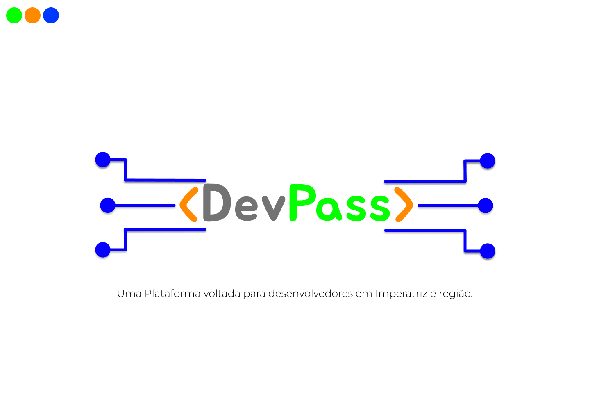
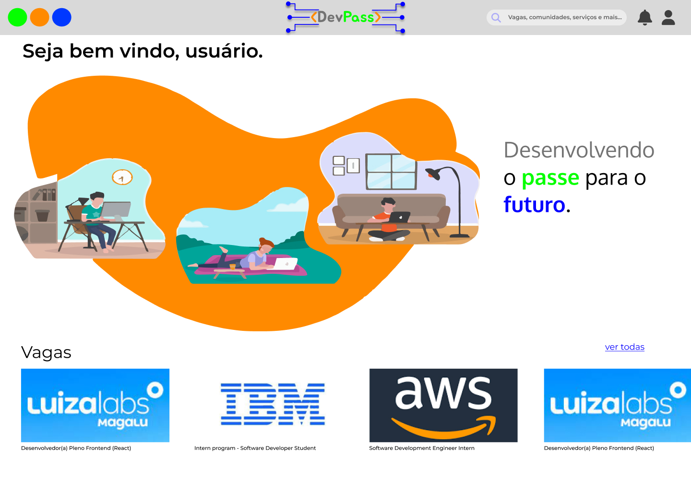

<h1 align="center"> DevPass </h1>

Projeto voltado à criação de uma plataforma para desenvolvedores de Imperatriz e arredores, de caráter OpenSource.   Tem como finalidade uma plataforma que proporcione; um sistema de comunidades para o usuários, podendo ser utilizada afimd e networking ou compartilhamento de conhecimentos; um sistema de cadastro de currículos/vagas; um sistema de notícias e avisos sobre a área da computação e outros processos importantes; e também um sistema de conteúdo educativo, sendo cursos ou artigos voltados à programação.

  <a href="#-tecnologias">Tecnologias</a>&nbsp;&nbsp;&nbsp;|&nbsp;&nbsp;&nbsp;
  <a href="#-projeto">Projeto</a>&nbsp;&nbsp;&nbsp;|&nbsp;&nbsp;&nbsp;
  <a href="#-layout">Layout</a>&nbsp;&nbsp;&nbsp;&nbsp;&nbsp;&nbsp;

  
  
O Nome DevPass e sua logo tem como objetivo transparecer o ar de futuro coletivo, em que comunidades e networkings entre desenvolvedores são o passe para o futuro na sua melhor versão.
 

  

##  🛠️Tecnologias Utilizadas

Esse projeto está sendo desenvolvido com as seguintes tecnologias:

- HTML e CSS.
- JavaScript.
- Git e Github.
- Figma.

## 💻  O Projeto

O projeto está hospedado no sistema Pages do GitHub, confira:

- [Acesse o projeto, online]:

#
